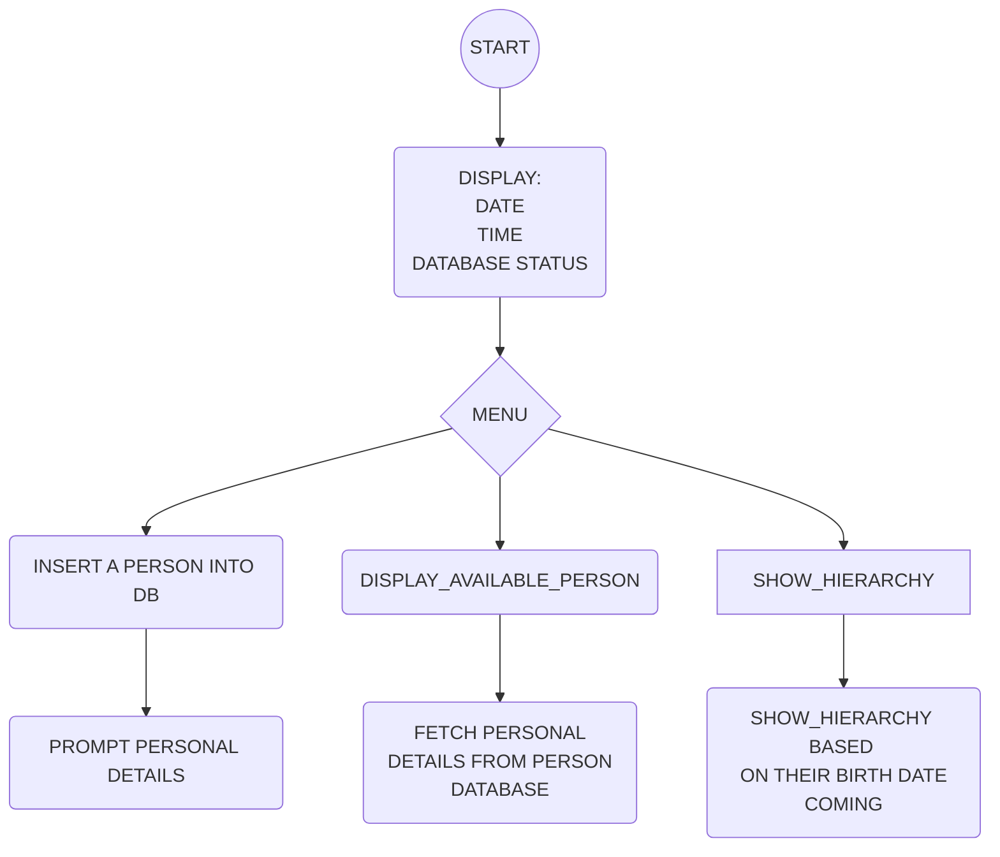

# RandomWord

Enter details of a person. It stores in a database. whenever the date of birth of a person is upcoming
an alert will be pop up on computer screen.

init.rc run.

birthday alert

```mermaid
flowchart TD
    START((START))-->DISPLAY(DISPLAY:  \n DATE \n TIME \n DATABASE STATUS)
    DISPLAY-->MENU(PROMPT OPTIONS)
    MENU{MENU}-->INSERT(INSERT A PERSON INTO DB)
    MENU-->DSP_AV(DISPLAY_AVAILABLE_PERSON)
    MENU-->SHOW_HIERARCHY
    INSERT-->PROMPT(PROMPT PERSONAL DETAILS)
    DSP_AV-->FETCH(FETCH PERSONAL\n DETAILS FROM PERSON DATABASE)
    SHOW_HIERARCHY-->B'DAY(SHOW_HIERARCHY BASED \n ON THEIR BIRTH DATE COMING)
``` 